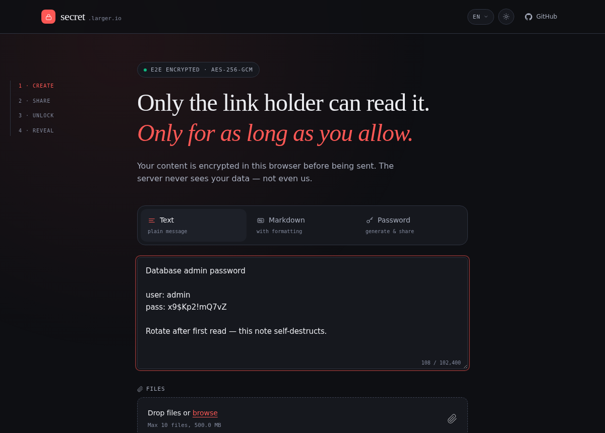
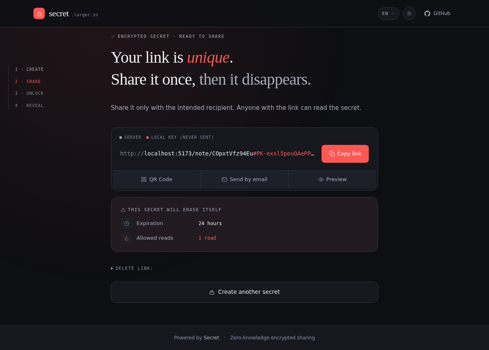
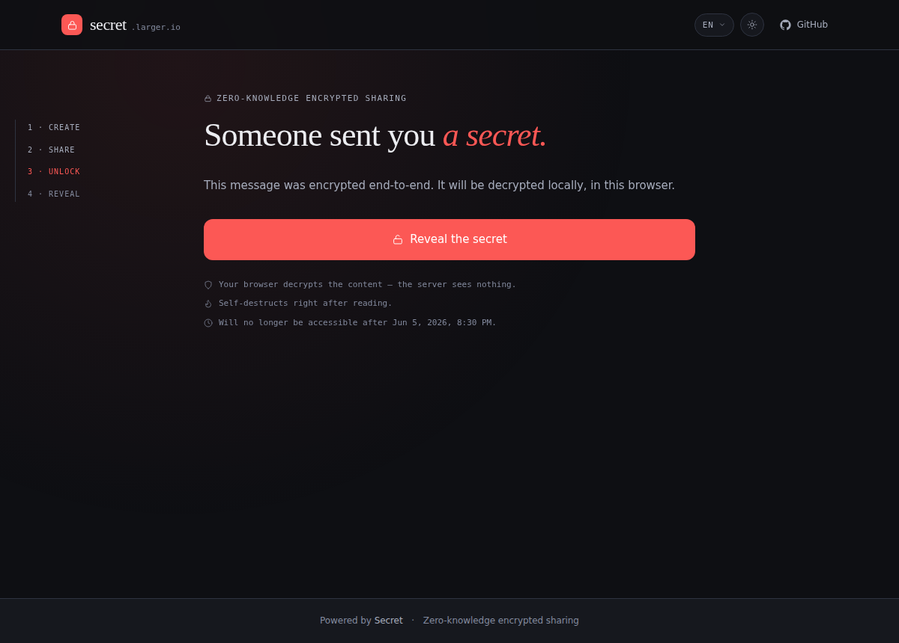

# Secret — Secure, Zero-Knowledge Encrypted Note & File Sharing

[](https://github.com/largerio/secret/actions/workflows/deploy.yml)
[](#development)
[](LICENSE)
[](https://github.com/largerio/secret/stargazers)
[](https://www.typescriptlang.org/)
[](https://ghcr.io/largerio/secret)

Share passwords, notes, and files securely with end-to-end encryption. Your data is encrypted in the browser using XChaCha20-Poly1305 — **the server never sees your content.** Self-hosted with a single Docker container. No accounts, no tracking, no logs.

A modern, open-source alternative to PrivateBin, OneTimeSecret, and Yopass — built with Svelte 5, Hono, and TypeScript.

**[🔗 Live demo](https://secret.larger.io)** &nbsp;·&nbsp; [Quick Start](#quick-start) &nbsp;·&nbsp; [Self-Hosting](docs/self-hosting.md) &nbsp;·&nbsp; [SDK](#sdk) &nbsp;·&nbsp; [Security](SECURITY.md)

<p align="center">
  
  &nbsp;
  
  &nbsp;
  
</p>

<p align="center"><sub><b>Create</b> → encrypted locally &nbsp;·&nbsp; <b>Share</b> → one-time link, key never sent &nbsp;·&nbsp; <b>Read</b> → decrypted in-browser, then gone</sub></p>

## Table of Contents

- [Features](#features)
- [Comparison](#comparison)
- [Quick Start](#quick-start)
- [SDK](#sdk)
- [How It Works](#how-it-works)
- [Configuration](#configuration)
  - [S3 Storage (optional)](#s3-storage-optional)
- [Self-Hosting (Synology, VPS, backups)](#self-hosting)
- [Updating](#updating)
- [Reverse Proxy](#reverse-proxy)
- [Development](#development)
- [Security](#security)
- [License](#license)
- [Contributing](#contributing)

## Features

- **Zero-knowledge encryption** — XChaCha20-Poly1305 (client) + AES-256-GCM (server)
- **Text & files** — Notes, documents, images, any file type. Up to 10 files per note, drag & drop.
- **Burn after read** — Destroyed after the first view
- **Password protection** — Optional, Argon2id key derivation
- **Auto-expiry** — 5 minutes to 30 days
- **Read limits** — Auto-delete after N reads
- **Delete token** — Manually delete a note at any time
- **File previews** — Images, PDF, video, audio rendered in-browser after decryption
- **Chunked uploads** — Stream large files in chunks with progress tracking (up to 500 MB)
- **S3 storage** — Optional S3-compatible backend (AWS, MinIO, R2) for large files
- **QR codes** — Share links easily on mobile
- **i18n** — 10 languages (en, fr, es, de, pt, it, ja, zh, ru, ko); add a new locale by dropping a JSON file in [`messages/`](messages/)
- **Self-hostable** — Single Docker container, customizable branding

## Comparison

| Feature                | Secret              | PrivateBin          | OneTimeSecret       | Yopass              |
|------------------------|---------------------|---------------------|---------------------|---------------------|
| Zero-knowledge         | Yes                 | Yes                 | No (server-side)    | Yes                 |
| Client cipher          | XChaCha20-Poly1305  | AES-256-GCM         | —                   | OpenPGP             |
| Server-side encryption | Yes (AES-256-GCM)   | No                  | Yes                 | No                  |
| File attachments       | Up to 10, 500 MB    | Single, opt-in      | No                  | Single, streaming   |
| File previews          | Image/PDF/AV        | Image/PDF/media     | No                  | No                  |
| Burn after read        | Yes                 | Yes                 | Yes                 | Yes (toggleable)    |
| Read limits (N reads)  | Yes                 | No                  | No                  | No                  |
| Password protection    | Yes (Argon2id)      | Yes (PBKDF2)        | Yes (passphrase)    | Yes                 |
| Official SDK           | Yes (JS/TS)         | No                  | REST API only       | CLI only            |
| Stack                  | Svelte 5 + Hono     | PHP                 | Ruby                | Go + React          |
| Deploy                 | Single Docker       | PHP server          | Ruby + Redis        | Single Docker       |

> Comparison reflects publicly documented features at the time of writing. See each project's docs for the latest details.

## Quick Start

**Fastest — prebuilt image (no clone, no build):**

```bash
mkdir secret && cd secret
curl -O https://raw.githubusercontent.com/largerio/secret/main/docker-compose.yml
curl -o .env https://raw.githubusercontent.com/largerio/secret/main/.env.example

# Generate a server encryption key (REQUIRED) and paste it into .env
openssl rand -base64 32   # → SERVER_ENCRYPTION_KEY=<output>
# Set APP_URL to your public URL (or leave http://localhost:3000 for local)

docker compose up -d      # pulls ghcr.io/largerio/secret:latest
```

Open `http://localhost:3000`. API documentation is available at `/api/v1/docs` ([Scalar](https://scalar.com/)).
If something doesn't work, run `docker compose logs -f` — see
[Troubleshooting](docs/self-hosting.md#troubleshooting).

**One-click / platform deploys:**

[](https://render.com/deploy?repo=https://github.com/largerio/secret)

| Platform | How |
|----------|-----|
| **Render** | Click the button above ([guide](docs/self-hosting.md#railway--render-paas)) |
| **Coolify** | New Resource → Docker Image → `ghcr.io/largerio/secret:latest` ([guide](docs/self-hosting.md#coolify)) |
| **Portainer** | Stacks → paste `docker-compose.yml` ([guide](docs/self-hosting.md#portainer)) |
| **Synology NAS** | Container Manager project ([guide](docs/self-hosting.md#synology-nas-dsm-7--container-manager)) |

**From source (for contributors):**

```bash
git clone https://github.com/largerio/secret.git
cd secret
cp .env.example .env
openssl rand -base64 32   # → set SERVER_ENCRYPTION_KEY in .env

# Uncomment `build: .` (and comment out `image:`) in docker-compose.yml to build locally
docker compose up -d
```

For Synology NAS, VPS, reverse proxy, troubleshooting and backup instructions, see the
[Self-Hosting guide](docs/self-hosting.md).

## SDK

Use the JavaScript/TypeScript SDK to interact with any Secret instance programmatically:

```bash
npm install @secret/sdk-js
```

```typescript
import { SecretClient } from "@secret/sdk-js";

const client = await SecretClient.create({
  baseUrl: "https://secret.example.com",
  apiKey: "your-api-key",
});

// Create a note
const { id, keyFragment } = await client.createNote({ text: "Hello, World!" });
const shareUrl = client.buildShareUrl(id, keyFragment);

// Read a note from a share URL
const parsed = SecretClient.parseShareUrl(shareUrl);
const { payload } = await client.readNote(parsed.id, parsed.keyFragment);
console.log(payload.text); // "Hello, World!"
```

## How It Works

```
Browser                                   Server
┌──────────────────────┐             ┌──────────────────┐
│ 1. Generate key      │             │                  │
│ 2. Encrypt (XChaCha) │──ciphertext►│ 3. Encrypt (AES) │
│                      │             │ 4. Store         │
│ URL: /note/id#key    │             │                  │
│        └─ never sent │             │ Never sees key   │
└──────────────────────┘             └──────────────────┘
```

The encryption key lives in the URL fragment (`#key`), which browsers never send to the server.

## Configuration

All settings via environment variables. See [.env.example](.env.example) for the full list.

| Variable | Default | Description |
|----------|---------|-------------|
| `SERVER_ENCRYPTION_KEY` | — | **Required.** AES-256-GCM key (32 bytes, base64) |
| `APP_NAME` | `Secret` | Application name |
| `APP_URL` | `http://localhost:3000` | Public URL |
| `APP_PRIMARY_COLOR` | `#6366f1` | Brand color (see `.env.example` for logo, favicon, footer…) |
| `MAX_FILE_SIZE` | `10485760` | Max file size in bytes (10 MB) |
| `MAX_FILES_PER_NOTE` | `10` | Max files per note |
| `MAX_EXPIRY` | `604800` | Max expiry in seconds (default: 7 days, max: 30 days) |
| `API_KEY` | — | API key for SDK clients (optional) |
| `API_KEY_1`, `API_KEY_2`… | — | Multiple API keys (optional) |
| `CHUNK_SIZE` | `4194304` | Chunk size for large uploads (4 MB) |
| `MAX_CHUNKED_FILE_SIZE` | `524288000` | Max chunked upload size (500 MB) |
| `PORT` | `3000` | Host port the app is published on (inside the container the web server always listens on 3000, the API on 3001) |

> **Warning:** Never change `SERVER_ENCRYPTION_KEY` after deployment — all existing notes become unreadable.

### S3 Storage (optional)

Files are stored locally by default. For larger files, enable S3-compatible storage:

```env
STORAGE_BACKEND=s3
S3_BUCKET=my-bucket
S3_REGION=us-east-1
S3_ENDPOINT=http://minio:9000    # MinIO / R2
S3_ACCESS_KEY_ID=your-key
S3_SECRET_ACCESS_KEY=your-secret
S3_FORCE_PATH_STYLE=true         # Required for MinIO
MAX_FILE_SIZE=104857600           # 100 MB
```

Compatible with AWS S3, MinIO, and Cloudflare R2.

## Self-Hosting

Step-by-step deployment guides for common setups are in
**[docs/self-hosting.md](docs/self-hosting.md)**:

- **VPS / any Docker host** — two-file deploy (`docker-compose.yml` + `.env`), no clone
- **Synology NAS** — DSM Container Manager walkthrough, with volume/permission notes
- **Reverse proxy & HTTPS** — including DSM's built-in reverse proxy
- **Backup & restore** — snapshotting the `secret-data` volume safely

## Updating

```bash
docker compose pull           # Pull new image
docker compose up -d          # Restart
docker image prune -f         # Clean up
```

Data lives in a Docker volume — updates never delete your notes.

## Reverse Proxy

**Caddy** (automatic HTTPS):
```
secret.example.com {
    reverse_proxy localhost:3000
}
```

**Nginx:**
```nginx
server {
    listen 443 ssl;
    server_name secret.example.com;

    location / {
        proxy_pass http://localhost:3000;
        proxy_set_header Host $host;
        proxy_set_header X-Real-IP $remote_addr;
        proxy_set_header X-Forwarded-For $proxy_add_x_forwarded_for;
        proxy_set_header X-Forwarded-Proto $scheme;
        client_max_body_size 600M;
    }
}
```

Set `client_max_body_size` to at least `MAX_CHUNKED_FILE_SIZE` (or `MAX_FILE_SIZE` if chunked uploads are not used). The example uses 600M as a safety margin above the 500 MB default.

## Development

```bash
pnpm install
pnpm dev          # API + web dev servers
pnpm test         # 422 tests, 100% backend coverage
pnpm lint         # Biome lint + format
pnpm build        # Production build
pnpm typecheck    # TypeScript strict
```

### Structure

```
apps/api/         Hono API (Node.js, SQLite, Drizzle ORM, OpenAPI)
apps/web/         SvelteKit frontend (Svelte 5, Tailwind CSS 4)
packages/sdk-js/  JS/TS SDK (SecretClient, encrypt/decrypt flows)
packages/crypto/  libsodium + AES-256-GCM encryption
packages/shared/  Zod schemas, types, constants, crypto test vectors
messages/         i18n (10 languages)
```

## Security

| Layer | Details |
|-------|---------|
| Client encryption | XChaCha20-Poly1305 (192-bit nonce, AEAD) |
| Server encryption | AES-256-GCM (defense-in-depth) |
| Password KDF | Argon2id (64 MiB, 3 iterations) |
| Write auth | PoW (Cap.js SHA-256) for browser, API keys for SDK |
| Token comparison | Timing-safe (`crypto.timingSafeEqual`) |
| Key hygiene | Zeroed after use (`sodium.memzero`) |
| Privacy | No IP logging, no cookies, no tracking |
| Database | SQLite `secure_delete`, WAL mode |
| Docker | Non-root, read-only filesystem, dropped capabilities |
| HTTP | Strict CSP, HSTS (preload), Permissions-Policy, per-IP rate limiting |
| Storage | Path traversal protection, S3 key validation |
| Validation | Zod schemas with max length constraints |

See [SECURITY.md](SECURITY.md) for the vulnerability disclosure policy.

## License

[MIT](LICENSE)

## Contributing

See [CONTRIBUTING.md](CONTRIBUTING.md).
